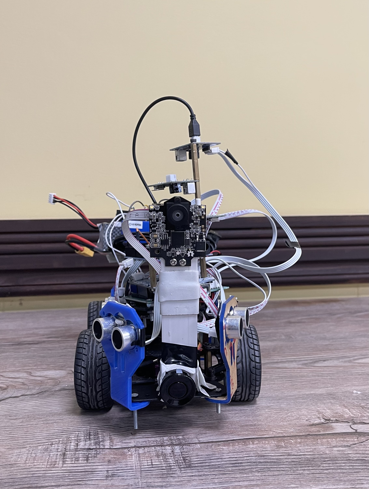
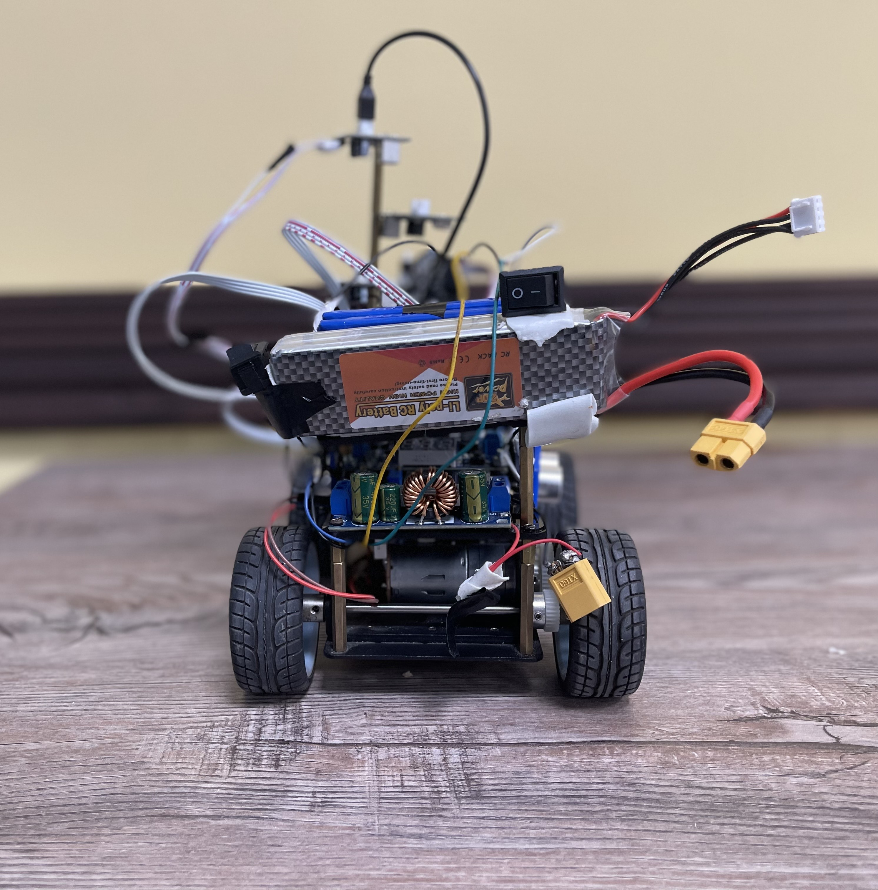
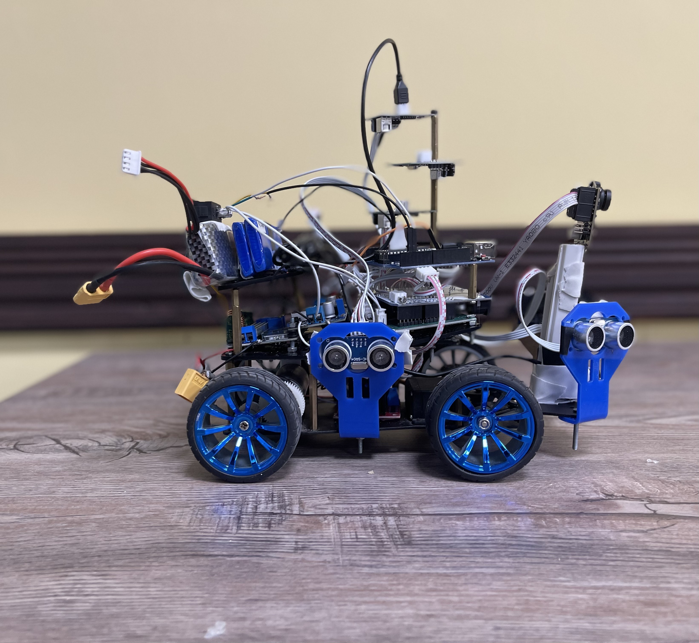
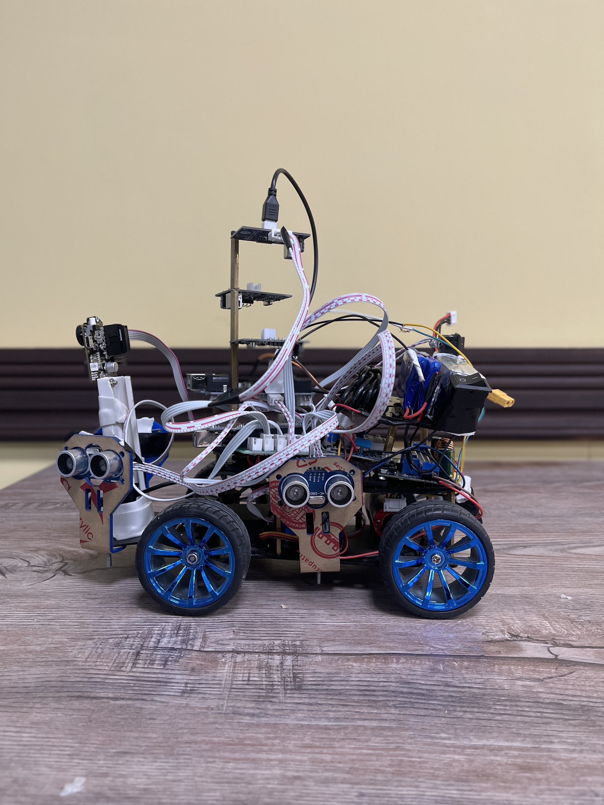
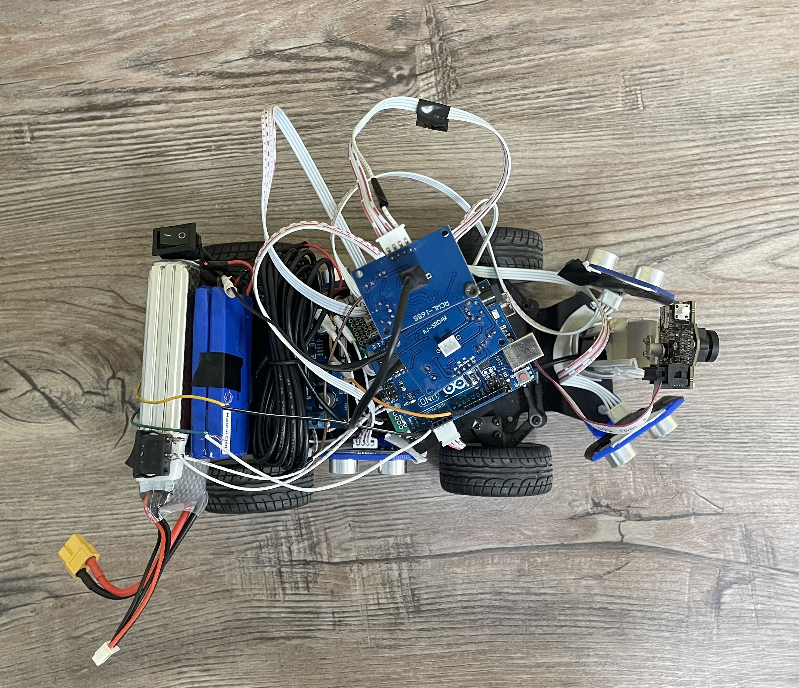
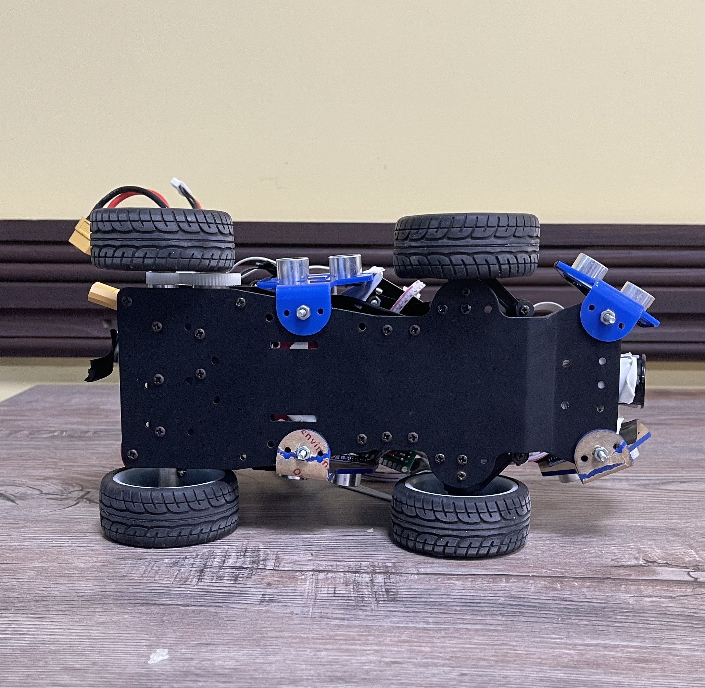

# WRO Future Engineer Project - Volt Zee
**Team: Volt Zee**

**Members: Zainab Khan, Ayesha Faizi, Ayesha Khan**

**WRO Category: Future Engineer**

**This repository serves as the official documentation for our team's participation in the WRO 2025 Future Engineers competition. It contains all essential project assets, including source code, CAD models, and the engineering journal detailing the design, development, and testing of our self-driving vehicle.** 

We, Zainab Khan, Ayesha Faizi, and Ayesha Khan participating in the WRO 2025 Future Engineers competition. We are excited to combine our skills and embark on this challenge together.
## Contents
* [Mobility and Hardware Design](#mobility-and-hardware-design)
* [Power and Sense Management](#power-and-sense-management)
    * [Power Management](#power-management)
    * [Sense Management](#sense-management)
    * [Wiring Diagram](#wiring-diagram)
* [Obstacle Management](#obstacle-management)
* [Photos](#photos)
* [Videos](#videos)
* [Enabling Reproducibility](#enabling-reproducibility)

# Mobility and Hardware Design

The robot is built on a 4WD smart car chassis kit equipped with four wheels powered by DC motors, providing stable movement and enough torque for sharp turns and smooth navigation.

An L298 motor driver module manages motor control, allowing precise speed and directional movement. To handle complex tasks, the design employs two Arduino Uno boards connected via master–slave communication:

- **Master Arduino** → High-level decision making (Pixy2 camera + path planning)  
- **Slave Arduino** → Real-time motor control and distance sensing  

A sensor shield is used to simplify wiring and integration, while structural reliability is ensured with 3D-printed brackets, brass hex standoffs, and metal screws.

Power is supplied through an RC Li-Po battery, with a buck converter regulating voltage for safe, stable operation. For safety, two ON/OFF switches allow controlled power management during testing and competitions.

Connections are maintained using Dupont jumper wires, while PCB prototyping boards provide flexibility for custom circuitry. Insulation and component securing are handled with black tape and double tape, and a USB Type-B cable connects the Arduinos for programming and debugging.

---

## Power and Sense Management

### Power Management
- **Power Source:** RC Li-Po battery  
- **Regulation:** Buck converter ensures safe voltage supply to Arduinos and sensors  
- **Switching:** Two ON/OFF switches enable controlled testing and competition usage  
- **Safety:** Dupont wires + PCB boards + insulation tape for stable wiring  

---

### Sense Management

Robot is equipped with **6 sensors** in total (**5 distance sensors + 1 camera**):

- **4 Ultrasonic Sonar Sensors** → Obstacle detection from multiple angles  
- **1 JSN-SR04T Waterproof Sensor** → Reliable detection in variable environments  
- **Pixy2 Camera** → Vision-based tracking, object recognition, and path following  

**Arduino Workload Distribution:**  
- **Master Arduino** → Pixy2 camera + ToF sensor (decision making)  
- **Slave Arduino** → Ultrasonic + waterproof sensors (real-time avoidance)  

---

### Wiring Diagram
📌 (Insert wiring diagram image here)  

---

## Obstacle Management

In the **Obstacle Challenge**, the robot used **4 ultrasonic sensors + JSN-SR04T waterproof sensor + Pixi Cam** to detect and bypass obstacles.  

- Sensors were mounted on elevated 3D-printed brackets to avoid ground reflection errors  
- The **Slave Arduino** controlled motor behavior in real time (slowing, steering, bypassing obstacles)  
- The **Master Arduino** coordinated safe resumption of speed and path alignment  

✅ Result: Obstacle handling was **consistent, adaptive, and reliable**.  

---

## Open Challenge

In the **Open Challenge**, the robot focused on **task-based navigation**:  

- **Pixy2 Camera** detected markers, lines, and objects on the field  
- **Ultrasonic + Waterproof sensors** ensured safety  
- **Master Arduino** handled vision  
- **Slave Arduino** executed motor commands  

This fusion allowed robot to:  
✅ Follow paths  
✅ Align with targets  
✅ Interact with specific points accurately  

---

## Challenges Faced & Fixes

- **Ultrasonic misplacement** → false readings → fixed with reinforced mounts  
- **Stability at high speed** → tilting → solved by reducing cornering speed + stronger brackets  
- **Loose battery wiring** → solved by soldering + rechecking connections  
- **Data sync delays** → solved with master–slave workload split  

---

## Team Roles

**🛠️ Ayesha Khan – Hardware & Power Systems**  
- Assembled chassis, mounted motors, connected L298 driver  
- Managed battery, buck converter, switches  
- Mounted sensors with 3D-printed brackets & standoffs  

**💻 Ayesha Faizi – Software & Sensor Integration**  
- Programmed master–slave Arduino communication  
- Slave: Ultrasonic + waterproof + motors  
- Master: Pixy2 + logic  
- Calibrated ranges, tuned motor response  

**💼 Zainab Khan – Documentation, Testing & Strategy**  
- Testing sessions (sensor accuracy & mobility)  
- Logged issues & proposed fixes  
- Maintained GitHub repo (diagrams, notes, components)  
- Coordinated for competition readiness  

---

## Component Cost Breakdown

| Component                  | Price (PKR) | Price (USD) |
|-----------------------------|-------------|-------------|
| 4WD Smart Car Chassis Kit  | 3,500       | 12.57       |
| 4 Wheels (included)        | 0           | 0.00        |
| L298 Motor Driver Module   | 800         | 2.87        |
| Arduino Uno (x2)           | 5,000       | 17.96       |
| Sensor Shield              | 700         | 2.51        |
| 5 Ultrasonic Sensors       | 1,500       | 5.39        |
| 1 JSN-SR04T Sensor         | 1,200       | 4.31        |
| Pixy2 Camera               | 18,000      | 64.63       |
| RC Li-Po Battery           | 6,000       | 21.54       |
| Buck Converter             | 500         | 1.79        |
| 2 ON/OFF Switches          | 200         | 0.72        |
| JST XH Connectors          | 300         | 1.08        |
| Dupont Jumper Wires (set)  | 400         | 1.44        |
| Flat Ribbon Cables         | 300         | 1.08        |
| USB Type-B Cable           | 250         | 0.90        |
| PCB Prototyping Boards     | 600         | 2.15        |
| 3D Printed Brackets        | 1,000       | 3.59        |
| Brass Hex Standoffs        | 500         | 1.79        |
| Metal Screws               | 200         | 0.72        |
| Black Tape                 | 100         | 0.36        |
| Double Tape                | 150         | 0.54        |
| **TOTAL**                  | **38,500**  | **138.36**  |

---

## Photos
<table>
  <tr>
    <td align="center">
      
    </td>
    <td align="center">
      
    </td>
  </tr>
  <tr>
    <td align="center">
      
    </td>
    <td align="center">
      
    </td>
  </tr>
  <tr>
    <td align="center">
      
    </td>
    <td align="center">
      
    </td>
  </tr>
</table>

---

## Videos

---

## Enabling Reproducibility
This repository provides:  
- Source code for Arduino (master & slave)  
- Circuit wiring diagrams  
- CAD models for 3D-printed mounts  
- Documentation & component lists  

So others can **replicate, test, and improve** upon our design.  

